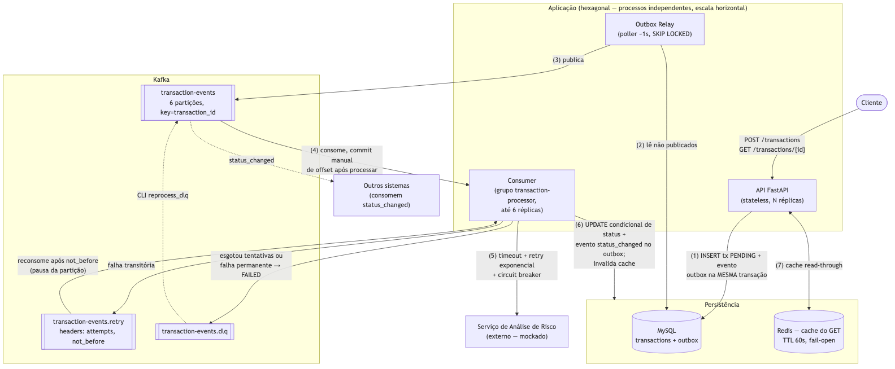

# BAMAQ — Processamento Assíncrono de Transações

Aplicação que recebe transações financeiras via API REST, as persiste em MySQL e as
processa de forma assíncrona via Kafka, consultando um serviço externo de análise de
risco. Projetada para operação confiável: outbox transacional, idempotência,
retry com backoff, circuit breaker, DLQ com reprocessamento e observabilidade.



*(Fonte do diagrama: [`docs/architecture.mmd`](docs/architecture.mmd); versão vetorial em [`docs/architecture.svg`](docs/architecture.svg))*

## Quick start

Pré-requisito: Docker + Docker Compose.

```bash
make up            # sobe MySQL, Kafka, Redis, API, consumer, outbox relay e mock de risco

# criar uma transação
curl -s -X POST localhost:8000/transactions \
  -H 'Content-Type: application/json' \
  -d '{"customer_id": "123", "value": 1500.00}'
# → 202 {"id": "<uuid>", "status": "PENDING", ...}

# consultar (após ~2s o status terá progredido)
curl -s localhost:8000/transactions/<uuid>
# → 200 {"status": "APPROVED", ...}
```

Tabela de serviços/portas, modos de falha do mock, operação e testes na seção
"Como executar" abaixo.

<details open>
<summary><strong>Como a aplicação funciona</strong></summary>

O ciclo de vida de uma transação, do POST à notificação:

1. **Criação** — `POST /transactions` valida a entrada, gera um UUID e, **em uma única
   transação MySQL**, persiste a transação com status `PENDING` e grava o evento
   `transaction.created` na tabela `outbox`. Responde `202 Accepted`. A API nunca fala
   com o Kafka — se o Kafka estiver fora, nada muda para o cliente.
2. **Publicação** — o processo **outbox relay** faz polling da tabela `outbox` (~1s,
   `FOR UPDATE SKIP LOCKED`, o que permite múltiplas réplicas) e publica os eventos
   pendentes no tópico Kafka `transactions`, com `key = transaction_id` (preserva a
   ordem por transação).
3. **Processamento** — o **consumer** recebe o evento, move o status para `PROCESSING`
   e chama `POST /risk-analysis` no serviço de risco (timeout 2s, até 3 retries
   in-process com backoff + jitter, atrás de um circuit breaker).
4. **Desfecho** — com a resposta (`APPROVED`/`REJECTED`), o consumer aplica um
   `UPDATE ... WHERE status = 'PROCESSING'` (condicional — duplicatas e corridas não
   corrompem estado), grava o evento `transaction.status_changed` na outbox (é assim
   que outros sistemas são notificados) e invalida o cache Redis.
5. **Falhas** — falha temporária do serviço de risco envia a mensagem ao tópico
   `transactions.retry` com backoff exponencial (headers `attempts`/`not_before`);
   após 5 tentativas totais — ou em falha permanente (4xx, payload inválido) — a
   mensagem vai à **DLQ** e a transação é marcada `FAILED`. `make reprocess-dlq`
   devolve as mensagens da DLQ ao fluxo.
6. **Consulta** — `GET /transactions/{id}` lê de um cache Redis read-through
   (TTL 60s, fail-open: Redis fora vira cache miss, nunca erro) com fallback no MySQL.
   Id inexistente → `404`.

**Estados da transação:**

```
PENDING ──► PROCESSING ──► APPROVED
   │             ├───────► REJECTED
   └─────────────┴───────► FAILED   (esgotou tentativas; reprocessável via DLQ)
```

</details>

<details open>
<summary><strong>Como executar (Docker Compose)</strong></summary>

Pré-requisito: Docker + Docker Compose.

```bash
make up            # ou: docker compose up -d --build
```

Isso constrói e sobe a stack completa. Os jobs one-shot `migrate` (migrações Alembic)
e `kafka-init` (criação dos tópicos) rodam antes de API/consumer/relay iniciarem:

| Serviço | Porta (host) | Papel |
|---|---|---|
| `api` | `8000` | REST: `POST/GET /transactions`, `/health`, `/metrics` |
| `risk-mock` | `8081` | Mock do serviço de análise de risco (+ `/control`) |
| `consumer` | — | Processa eventos; métricas em `:9101` (interno à rede) |
| `outbox-relay` | — | Publica eventos da outbox no Kafka |
| `mysql` | `3306` | Persistência (transações + outbox) |
| `kafka` | `29092` | Mensageria (KRaft, sem ZooKeeper) |
| `redis` | `6379` | Cache read-through do GET |

**Usando a API:**

```bash
# criar uma transação
curl -s -X POST localhost:8000/transactions \
  -H 'Content-Type: application/json' \
  -d '{"customer_id": "123", "value": 1500.00}'
# → 202 {"id": "<uuid>", "status": "PENDING", ...}

# consultar (após ~2s o status terá progredido)
curl -s localhost:8000/transactions/<uuid>
# → 200 {"id": "...", "customer_id": "123", "value": "1500.00", "status": "APPROVED"}

# id inexistente → 404 {"detail": "transaction not found"}
```

O mock de risco aprova `value <= 10000` e rejeita acima. Modos de falha em runtime:

```bash
curl -X POST localhost:8081/control -d '{"mode": "fail"}' -H 'Content-Type: application/json'      # passa a responder 503
curl -X POST localhost:8081/control -d '{"latency_seconds": 5}' -H 'Content-Type: application/json' # latência alta
curl -X POST localhost:8081/control -d '{"mode": "normal", "latency_seconds": 0}' -H 'Content-Type: application/json'
```

**Operação:**

```bash
make scale-consumers   # escala o consumer para 3 réplicas
make reprocess-dlq     # republica mensagens da DLQ no tópico principal
make logs              # logs (JSON estruturado) de api/consumer/outbox-relay
make down              # derruba tudo (incluindo volumes)

curl -s localhost:8000/metrics                                   # métricas da API
docker compose exec consumer curl -s localhost:9101/metrics      # métricas do consumer
```

**Testes** (requer Python 3.12 local):

```bash
python3.12 -m venv .venv && .venv/bin/pip install -e '.[dev]'
make test              # unitários (87) — não requerem infraestrutura
make coverage          # unitários com relatório de cobertura (falha abaixo de 85%)
make test-integration  # repositórios contra o MySQL do compose (requer make up)
make test-e2e          # fluxo completo contra a stack do compose (requer make up)
```

</details>

<details>
<summary><strong>Arquitetura</strong></summary>

**Hexagonal (Ports and Adapters).** O core (`src/app/domain` + `src/app/application`)
não importa nada de infraestrutura; Kafka, MySQL, Redis, httpx e FastAPI são adapters
plugados por interfaces (`src/app/application/ports.py`):

```
src/app/
  domain/          # Transaction, máquina de estados, eventos de domínio
  application/     # use cases (Create/Get/Process/MarkFailed/RelayOutbox) + ports
  adapters/
    inbound/       # rotas FastAPI; handler e loop do consumer Kafka
    outbound/      # repositórios SQLAlchemy, producer Kafka, cache Redis,
                   # cliente HTTP de risco (retry + circuit breaker)
  entrypoints/     # processos: api, consumer, outbox_relay, reprocess_dlq
```

Três processos independentes (API, consumer, outbox relay) compartilham o mesmo
pacote e escalam separadamente.

Transições de estado são validadas no domínio e aplicadas com
`UPDATE ... WHERE status = <esperado>` (condicional): duplicatas e corridas não
corrompem estado.

</details>

<details>
<summary><strong>Decisões e trade-offs</strong></summary>

| Decisão | Alternativa | Por quê |
|---|---|---|
| **Transactional Outbox + poller próprio** | Debezium/CDC | Consistência DB↔Kafka sem infra extra (Kafka Connect); código simples de operar e defender. Custo: ~1s de latência de polling e carga de SELECT no MySQL. |
| **Poller com `FOR UPDATE SKIP LOCKED`** | Publicação direta pela API | Permite múltiplas réplicas do relay sem duplicar trabalho; API nunca fica acoplada à disponibilidade do Kafka. |
| **Redis como cache read-through do GET** | Só MySQL | Alivia leitura sob polling intenso de clientes. **Fail-open**: Redis fora = cache miss, nunca erro. Invalidação ativa na mudança de status + TTL 60s como rede de segurança. |
| **Idempotência por estado no MySQL** | Tabela de mensagens processadas / chave no Redis | O estado da transação já é o registro canônico de progresso; UPDATE condicional dá atomicidade sem estrutura extra. |
| **Retry via tópico separado + headers (`attempts`, `not_before`)** | Sleep no consumer / rdkafka retries | Não bloqueia o tópico principal; backoff exponencial (2s·2ⁿ) visível e testável. Consumer pausa apenas a partição do retry até `not_before`. |
| **Circuit breaker próprio (~60 linhas)** | pybreaker | Testável com clock fake, comportamento totalmente conhecido, sem dependência. |
| **SQLAlchemy sync em todos os processos** | Async | confluent-kafka é sync; um único modelo de sessão em API (threadpool do FastAPI), consumer e relay simplifica raciocínio e revisão. |
| **`enable.idempotence=true` no producer** | default | Elimina duplicatas do produtor em retries de rede — barato e sem downside. |
| **Flush síncrono no caminho retry/DLQ** | Batch | O offset só pode ser commitado após durabilidade do reenvio; volume desse caminho é baixo. |

</details>

<details>
<summary><strong>Cenários de falha (Parte 1)</strong></summary>

| Cenário | Como a arquitetura responde |
|---|---|
| **1. Persiste no MySQL, falha ao publicar no Kafka** | O evento é gravado na tabela `outbox` **na mesma transação** do INSERT. A API nem fala com o Kafka. O relay publica quando o Kafka voltar — nada se perde. Demonstrável: `docker compose stop kafka`, criar transação (202 normal), `start` → processa. |
| **2. Consumer atualiza o banco e morre antes do commit de offset** | Entrega at-least-once: a mensagem é reentregue. O handler relê o estado — se já terminal, ACK sem reprocessar; se `PROCESSING`, retoma dali (testado em `test_redelivery_after_crash_processes_from_processing_state`). |
| **3. Serviço externo fora por 30 min** | Timeout 2s → 3 retries in-process (backoff+jitter) → circuit breaker abre (5 falhas) e falha rápido → mensagem vai ao tópico `.retry` com `not_before` crescente → após 5 tentativas totais, DLQ + status `FAILED`. Quando o serviço volta, `make reprocess-dlq` reprocessa. Transações novas seguem sendo aceitas o tempo todo. |
| **4. Mensagem duplicada** | Idempotência por estado: estados terminais são ignorados com ACK; a transição final é um UPDATE condicional — só um vencedor. Duplicatas do produtor são suprimidas por `enable.idempotence`. |
| **5. 100 → 10.000 eventos/min (100×)** | 10k/min ≈ 167/s. Tópico com 6 partições → até 6 consumers em paralelo (`make scale-consumers`); key=`transaction_id` preserva ordem por transação. API stateless escala atrás de load balancer. O gargalo seguinte é o MySQL (ver Limitações). |

</details>

<details>
<summary><strong>Confiabilidade</strong></summary>

- **Consistência DB↔mensageria:** outbox transacional; relay at-least-once; consumers idempotentes absorvem duplicatas.
- **Ordenação:** partição por `transaction_id` garante ordem por agregado no tópico principal.
- **Retry:** in-process (rápido, para blips) + tópico de retry (lento, para outages), limite de 5 tentativas.
- **DLQ:** mensagens esgotadas ou com falha permanente (4xx, payload inválido) + transação marcada `FAILED`; CLI `reprocess_dlq` devolve ao fluxo com contador zerado.
- **Versionamento de eventos:** envelope `{event_id, event_type, version, occurred_at, payload}`. Campos novos = mesma versão (consumers ignoram campos desconhecidos); mudança breaking = bump de `version` e consumo condicional durante a transição.

</details>

<details>
<summary><strong>Observabilidade</strong></summary>

- Logs **JSON estruturados** (structlog) em todos os processos, sempre com
  `transaction_id` (e `event_type`, tentativa, motivo da falha quando aplicável).
- Falhas relevantes logadas com contexto: retry agendado, tentativas esgotadas,
  circuito aberto/fechado, mensagem imparseável, ciclo do relay com erro.
- Métricas Prometheus: API em `GET :8000/metrics` (`transactions_created_total`);
  consumer em `:9101/metrics`, interno à rede do compose — a porta não é publicada
  no host para permitir `--scale consumer=3` sem conflito
  (`docker compose exec consumer curl -s localhost:9101/metrics`). Métricas:
  `transactions_processed_total{outcome}`, `risk_analysis_seconds`.

</details>

<details>
<summary><strong>Estratégia de testes</strong></summary>

| Camada | O que cobre | Dependências |
|---|---|---|
| **Unitários (87)** | Domínio (transições), use cases com fakes das ports (sucesso, duplicado, corrida, indisponibilidade), circuit breaker (clock fake), handler e loop do consumer (retry/DLQ/poison, pausa/retomada de partição), cliente de risco (httpx MockTransport), API (TestClient), cache fail-open, adapters SQLAlchemy (SQLite em memória), publisher Kafka (producer fake), wiring dos 4 entrypoints, settings/logging/clock | Nenhuma |
| **Integração (3)** | Repositórios SQLAlchemy contra MySQL real: roundtrip, semântica do UPDATE condicional, fetch/mark do outbox | `make up` |
| **E2E (4)** | Aprovação, rejeição, **outage temporário com recuperação via retry**, 404 | `make up` |

**Cobertura: 98%** nos unitários (`make coverage`); o CI falha abaixo de 85%
(`fail_under` no `pyproject.toml`). Os pontos cegos restantes são ramos de erro
de wiring, cobertos indiretamente pelos testes e2e.

**Casos exigidos no enunciado → testes:**

| Caso do enunciado | Teste |
|---|---|
| Fluxo de sucesso | unit: `test_happy_path_processes_created_event`; e2e: aprovação/rejeição |
| Processamento duplicado | unit: `test_terminal_transaction_is_skipped_idempotently` |
| Falha temporária do serviço externo | unit: `test_transient_5xx_is_retried_until_success`; e2e: `test_temporary_risk_outage_recovers` |
| Falha definitiva após múltiplas tentativas | unit: `test_retry_exhaustion_goes_to_dlq_and_marks_failed` |
| Consulta de transação inexistente | unit: `test_get_unknown_returns_404`; e2e: `test_unknown_transaction_is_404` |

</details>

<details>
<summary><strong>Limitações conhecidas</strong></summary>

1. **Latência do poller (~1s)** e carga de SELECT no MySQL; em volume alto, o próximo passo seria CDC (Debezium).
2. **MySQL é o primeiro gargalo em 10k/min** (escritas de status + outbox). Evolução: read replicas para o GET, particionamento/arquivamento do outbox, batch de `mark_published`.
3. **Retry quebra ordenação estrita**: uma mensagem que vai ao tópico de retry é ultrapassada por mensagens novas da mesma partição. Aceitável aqui (um evento de processamento por transação); não serviria para agregados com múltiplos eventos dependentes.
4. **Pausa de partição no retry** segura mensagens posteriores da mesma partição do tópico de retry até `not_before` — com poucas partições de retry e outage longo, o throughput de retry cai.
5. **Cache pode servir status defasado por até 60s** se a invalidação falhar (Redis fora no momento do update); o TTL limita a janela.
6. **Sem autenticação/autorização** na API e sem TLS — fora do escopo do desafio.
7. **Mock de risco** não simula todos os comportamentos de um serviço real (rate limit, respostas parciais, jitter de rede).
8. **Observabilidade sem tracing distribuído** — OpenTelemetry seria o próximo incremento natural.

</details>

